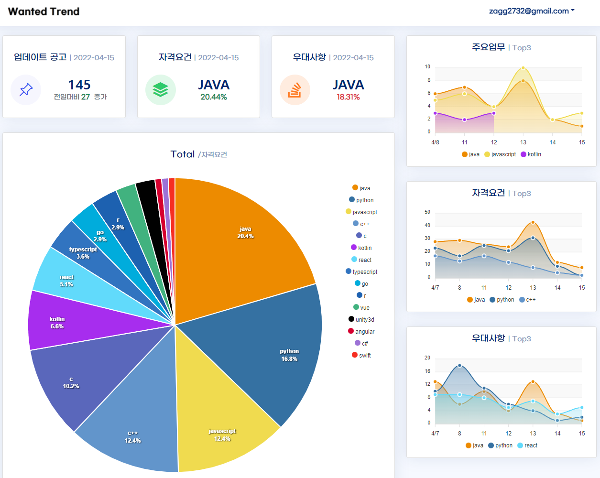

WANTED_TREND_WEB
===
***

## 📸 Site Screenshot


## 🔗 Link
- **배포 사이트 :** http://wantedtrend.site &ensp; 
- **파이썬 크롤링 :** https://github.com/Zagg2732/wanted_trend


* * *
# Introduce Project
* * *
이 프로젝트는 1인 프로젝트 입니다.

- 채용 플랫폼 [Wanted](https://wanted.co.kr/) 의 공고들을 통해 대한민국 기업들이 원하는 프로그래밍 언어 추세를 크롤링 했습니다([WANTED_TREND](https://github.com/Zagg2732/wanted_trend/))

- 크롤링한 데이터를 분석하여 얻은 인사이트를 한눈에 알수있게 차트로 표현했습니다

- SpringBoot Schedular를 통해 매일 원하는 시간에 크롤링하여 데이터가 갱신되게끔 구현했습니다

- AWS 서버에 배포되었습니다 [사이트](http://wantedtrend.site)


## BACKEND

1. SpringBoot Scheduling 을 활용하여 원하는 시간에 Java 코드로 python compiler를 실행합니다.
2. 파이썬의 requests를 활용하여 원티드 사이트의 웹정보를 받아오고, openpyxl을 활용하여 원하는 정보를 excel 형태로 저장합니다.
3. 크롤링 및 엑셀 저장이 완료되면 Java에서 해당 파일을 읽어오고, JPA를 활용하여 AWS Cloud DB(MariaDB) 에 저장합니다.
4. JPA를 활용하여 DB를 분석하고 원하는 정보를 Java enum class 를 활용하여 크롤링 언어와 차트에서 표현할 색상을 매치합니다.
5. Json 파일로 저장합니다.

## FRONTEND

- Vue.js project로 구성되었습니다.
- 화면 디자인은 Bootstrap5 템플릿을 커스텀하였습니다.
- Vue.js 의 Lifecycle을 활용하여 restful api 통해 Json 데이터를 받아옵니다.
- Apexchart 라이브러리에 json 데이터를 연동해 데이터를 표현합니다.


## 🛠 Stack
### Front-End
- Vue.js 3 
- Vue-Router 4
- Vue-axios 
- Bootstrap5
- Apexchart

### Back-End
- Java 1.8
- Gradle 
- Spring Boot
- JPA

### DataBase
- MariaDB (AWS)

### Server
- AWS free-tier (Amazon EC2 - AWS linux os)


## 📌 Features
- Vue.js를 활용한 SPA 방식의 사이트 구현
- Bootstrap 5.0.2 를 활용한 사이트 디자인 및 modal 기능 구현
- JPA 를 활용한 DB 개발
- Restful api 구현
- npm 을 활용한 페이징처리
- Gradle 빌드 도구 사용
- 게시글, 댓글에 관련한 기본적인 CRUD 구현
- 게시글 파일 미리보기, 업로드, 다운로드 구현

## 💿 Installation
```
# required
- Java 1.8
- Node.js
- Vue 3.x.x
- Python 3.x.x

# clone repo
git clone https://github.com/Zagg2732/wanted_trend_web.git
```

### `application.properties` File settings
>> src/main/resources/```application.proterties```
>   ~~~
> spring.devtools.livereload.enabled=true
> spring.jpa.show-sql=true (true: jpa log console)
>
> server.port = 서버 포트(default : 8080)
>
> # none for test
> spring.jpa.hibernate.ddl-auto= validate
> logging.level.org.hibernate.type=trace
>
> spring.datasource.driver-class-name=org.mariadb.jdbc.Driver
>
> spring.datasource.url=jdbc:mariadb://db주소:포트/테이블이름
> spring.datasource.username=아이디
> spring.datasource.password=비밀번호
>
> # project custom path
> path.refresh.wanted_json=매일 변경되는 json 폴더
> path.logging.wanted_json=json들을 매일 저장할 폴더(logging)
> path.load.wanted_excel=excel file이 저장된 폴더
>
> # python path (wanted_trend 프로젝트 연동)
> path.load.python_scripts=파이썬스크립트(python.exe or python3) 절대경로
> path.load.python_main=파이선 main.py 절대경로
>
> python command {begin : 처음시작 or 특정 개수 크롤링시, daily : 매일실행, 이전~최신 크롤링}
> path.load.python_crawl_command=begin 혹은 daily
>   ~~~
